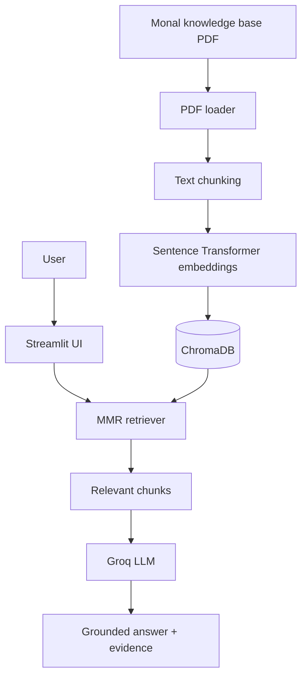

# Architecture

## Components

- `scripts/ingest.py` loads the PDF, splits it into overlapping chunks, embeds those chunks, and writes `data/chroma/`.
- `rag/retriever.py` opens Chroma, retrieves diverse relevant chunks with MMR, and asks Groq to answer strictly from that context.
- `app.py` provides the Streamlit interface and displays the source pages returned by retrieval.

The vector database is generated locally and ignored by Git. Re-run ingestion when the source PDF changes.
